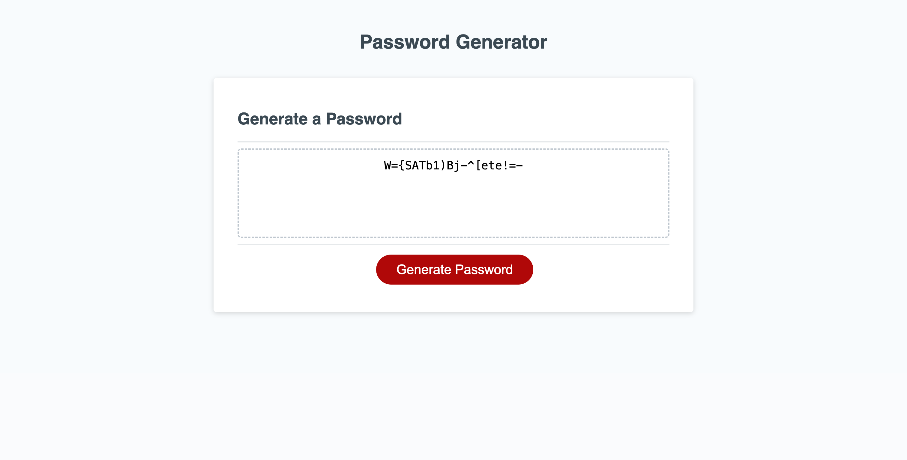

# Password Generator

## Table of Contents
- [Description](#description)
- [Deployed Application](#deployed-application)
- [Usage](#usage)
- [Screenshot](#screenshot)
- [Tests](#tests)
- [Author and Acknowledgment](#author-and-acknowledgment)
- [License](#license)

## Description 
This project is a browser-based password generator. It was created to provide users with a quick and secure way to generate random passwords that meet various security criteria.

- **Motivation:** With the increasing need for strong online security, having a tool that can generate complex passwords is essential.
- **Purpose:** The purpose of this tool is to make strong password creation straightforward and accessible for every internet user, regardless of their technical background.
- **Problem It Solves:** This project addresses the common problem of weak password habits by automating the generation of complex credentials.
- **What I Learned:** Through this project, I learned about user input validation, manipulating strings in JavaScript, enhancing user experience, and the importance of providing a user-friendly interface that accommodates different user interactions, including cancellations. 

## Deployed Application
This deployed application can be viewed here: [https://ktotah.github.io/ktotah-password-generator/](https://ktotah.github.io/ktotah-password-generator/)

## Usage
To use this password generator, simply:

1. Open the application in your browser. 
2. Click on the "Generate Password" button.
3. Follow the on-screen prompts to choose the length and character types for your password.

## Screenshot
Below is a **screenshot** of the deployed application, featuring an example password it generated with 20 characters and including all character types (uppercase, lowercase, numeric, and special characters):

## Tests
To ensure the password generator works as expected, several tests were conducted:

1. Validate the password length is between 8 and 128 characters.
2. Confirm that at least one character type is selected.
3. Check that the generated password correctly adheres to the user-selected criteria.

For further testing, you can manually test the application by following the [usage instructions](#usage) above.

## Author and Acknowledgment
- **Katy Totah** - *Initial work* - [Katy Totah](https://github.com/ktotah)

## License
This project is released under the [MIT License](./LICENSE).

